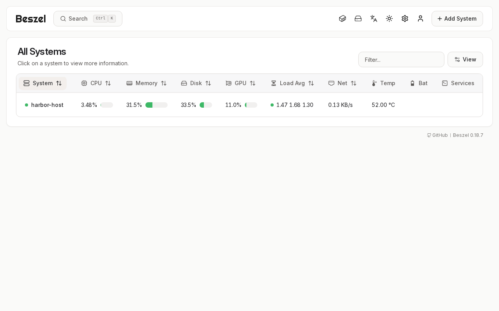
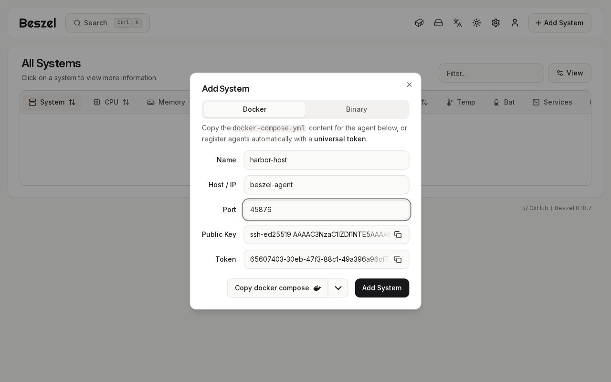

### [Beszel](https://github.com/henrygd/beszel)

> Handle: `beszel`<br/>
> URL: [http://localhost:34841](http://localhost:34841)

Beszel is a lightweight server monitoring platform with historical data, Docker container stats, and alerts. It is built on PocketBase and ships as two components:

- **Hub** (`beszel`) — the web dashboard and PocketBase backend that stores systems, alerts, and historical metrics. This is the primary user-facing service.
- **Agent** (`beszel-agent`) — a per-host collector that gathers CPU, memory, disk, network, container, temperature, GPU, and S.M.A.R.T. metrics and reports them back to the hub.

Harbor runs both components in the same compose file, so the local Docker host is monitored out of the box.



#### Architecture

```
+----------+     harbor-network     +--------------+
| beszel   | <--------------------- | beszel-agent |
| (hub)    |   reads on port 45876  | (collector)  |
| :8090    |                        |              |
+----------+                        +--------------+
     |                                     |
     | volume: services/beszel/data        | mount: /var/run/docker.sock:ro
     v                                     v
 PocketBase DB                       Docker stats
```

The hub connects to the agent on the internal harbor network at `beszel-agent:45876`. The agent mounts `/var/run/docker.sock` read-only to read container stats. Authentication between hub and agent is by SSH public key — the hub generates a key on first launch and the user pastes it into the agent config.

A small one-shot init container, `beszel-agent-init`, runs before the agent and materializes a `KEY_FILE` at `services/beszel/agent/key.pub`. If `HARBOR_BESZEL_AGENT_KEY` is set, the init validates that it parses as an SSH public key and writes it; if it does not parse, the init container fails fast with a clear error so the bad value never reaches the agent. If the variable is empty, a throwaway placeholder ed25519 key is generated so the agent — which is a distroless image and refuses to start with an unparseable key — can boot, listen on its port, and idle while rejecting connections from any hub. This is what lets you complete the first-run flow below in one pass instead of having to fight a crash-looping agent.

#### Starting

```bash
harbor pull beszel
harbor up beszel --open
```

##### First-Run Flow

The agent will run but cannot authenticate against the hub until you copy the hub's SSH public key into the agent config. The expected flow is:

1. `harbor up beszel --open` — opens the hub at [http://localhost:34841](http://localhost:34841).
2. Create the admin account through the web UI (Beszel uses PocketBase auth).
3. Click **Add System** in the dashboard.
   - **Name**: anything, e.g. `harbor-host`
   - **Host/IP**: `beszel-agent` (the internal compose service name — reachable from the hub on the harbor network)
   - **Port**: `45876`
   - The dialog displays an SSH public key (`ssh-ed25519 AAAA...`).

   
4. Copy that key and persist it via Harbor config:
   ```bash
   harbor config set beszel.agent.key 'ssh-ed25519 AAAA... your-hub-key'
   ```
5. Restart the service so the agent picks up the new key:
   ```bash
   harbor restart beszel
   ```
   This restarts the whole beszel group (hub, init, agent) and re-runs the init container so the new key is written to disk before the agent starts. `harbor restart beszel-agent` does **not** work — `beszel-agent` is not separately addressable by the CLI; it is part of the `beszel` group.
6. The system status should turn green in the dashboard within ~30 seconds.

Until step 4 is complete, the agent container starts and listens on its port but rejects hub connections — this is normal and expected.

#### Configuration

##### Environment Variables

Following options can be set via [`harbor config`](./3.-Harbor-CLI-Reference.md#harbor-config):

```bash
# Hub web port (PocketBase + dashboard)
HARBOR_BESZEL_HOST_PORT          34841

# Hub image and version
HARBOR_BESZEL_IMAGE              henrygd/beszel
HARBOR_BESZEL_VERSION            latest

# Hub data directory (PocketBase database, history, settings)
HARBOR_BESZEL_WORKSPACE          ./services/beszel

# Agent (per-host collector) image and version
HARBOR_BESZEL_AGENT_IMAGE        henrygd/beszel-agent
HARBOR_BESZEL_AGENT_VERSION      latest

# Internal port the agent listens on inside the harbor network.
# The hub reaches it at beszel-agent:${HARBOR_BESZEL_AGENT_PORT}.
HARBOR_BESZEL_AGENT_PORT         45876

# SSH public key generated by the hub on first launch. Empty by default —
# paste via `harbor config set beszel.agent.key '<key>'` after first login.
HARBOR_BESZEL_AGENT_KEY          (empty)

# Optional shared-secret token issued by the hub when adding a system in
# "universal token" mode. Leave empty for the default key-only flow.
HARBOR_BESZEL_AGENT_TOKEN        (empty)

# Optional hub URL for token-based agent auto-registration.
HARBOR_BESZEL_AGENT_HUB_URL      http://beszel:8090
```

##### Volumes

The hub persists state in `services/beszel/data/` (mounted to `/beszel_data` inside the container). This includes the PocketBase SQLite database, the SSH key pair generated on first launch, uploaded assets, and historical metric snapshots.

The agent's `KEY_FILE` lives in `services/beszel/agent/` (mounted read-only into the agent at `/agent_data/`). It is written by `beszel-agent-init` from `HARBOR_BESZEL_AGENT_KEY`, or seeded with a placeholder if that var is empty.

The hub and init containers run as the host user (`HARBOR_USER_ID:HARBOR_GROUP_ID`), so files under `services/beszel/data/` and `services/beszel/agent/` are owned by the host user and can be inspected, backed up, or removed without `sudo`.

The agent also mounts `/var/run/docker.sock:/var/run/docker.sock:ro` to read container stats. This is read-only — the agent cannot start, stop, or otherwise modify containers. If you do not want the agent to access the Docker socket at all, comment out the volume in `services/compose.beszel.yml`; container metrics will then be unavailable but host metrics still work.

#### Monitoring Additional Hosts

The bundled `beszel-agent` service only monitors the host running Harbor. To monitor other machines, follow the upstream agent install guide:

- [Beszel agent install (binary)](https://beszel.dev/guide/agent-installation)
- [Beszel agent (Docker)](https://github.com/henrygd/beszel#docker-agent)

The remote agent needs network reach to the hub on `34841` (or whatever you set `HARBOR_BESZEL_HOST_PORT` to).

#### Troubleshooting

```bash
harbor logs beszel
harbor logs beszel-agent
harbor logs beszel-agent-init
```

(All of `harbor logs` tail by default — Ctrl-C to break out.)

Common issues:

- **"system offline" in the dashboard** — the agent has not been keyed yet. Complete the first-run flow above.
- **Agent logs show "key mismatch" or auth errors** — the configured `HARBOR_BESZEL_AGENT_KEY` does not match the hub's current key. Re-copy from the dashboard and run `harbor config set beszel.agent.key '<key>'` followed by `harbor restart beszel`.
- **`beszel-agent-init` exits with "HARBOR_BESZEL_AGENT_KEY is set but does not parse..."** — the value pasted into `harbor config set beszel.agent.key '...'` is malformed (truncated, wrong field, or has extra whitespace). Re-copy the full `ssh-ed25519 AAAA... comment` line from the hub's Add System dialog. To clear the value entirely: `harbor config set beszel.agent.key '' && harbor restart beszel`.
- **Container stats missing** — the docker.sock mount is required. Verify with `docker inspect harbor.beszel-agent | grep docker.sock`.
- **Forgot the admin password** — Beszel uses PocketBase; reset by stopping the hub and editing the database under `services/beszel/data/pb_data/`, or remove that directory to start fresh (destroys all history). Files there are owned by the host user, so `rm -rf services/beszel/data/pb_data/` works without `sudo`.

#### Links

- [Beszel website](https://beszel.dev)
- [GitHub Repository](https://github.com/henrygd/beszel)
- [Agent installation guide](https://beszel.dev/guide/agent-installation)
