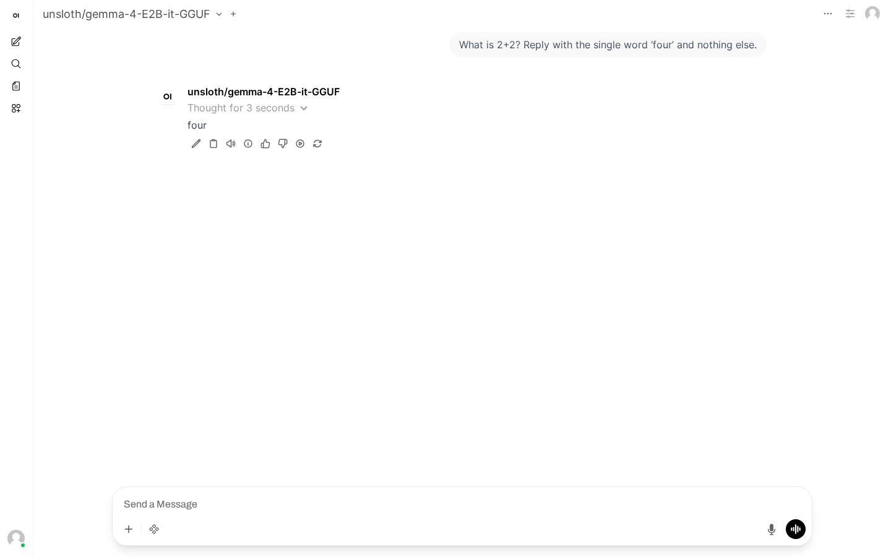

### [Unsloth Studio](https://github.com/unslothai/unsloth)

> Handle: `unsloth-studio`<br/>
> URL: [http://localhost:34851](http://localhost:34851)


Unsloth Studio is a no-code web UI for fine-tuning LLMs with the Unsloth library. It provides 2x faster training with 70% less memory compared to standard fine-tuning, and is powered by `llama.cpp` and Hugging Face under the hood. Studio runs from the unified `unsloth/unsloth` image but exposes only the Studio surface (port 8000) — the existing [`unsloth`](./2.3.51-Satellite-Unsloth.md) Harbor service continues to provide Jupyter Lab and SSH access on the same image when you need those.

> **Note:** Studio is in beta upstream. The two services share the `unsloth/unsloth` image and a single `--gpus all` reservation, so on a single-GPU host you should run only one of `unsloth` or `unsloth-studio` at a time.

#### Getting started

1. **Pre-pull the image** (one-time). The unified `unsloth/unsloth:latest` image is large — **~13.6 GB compressed** download, **~44.5 GB unpacked** on disk. Pre-pulling once means your first `harbor up` won't block on the download:
   ```bash
   docker pull unsloth/unsloth:latest
   # or: harbor pull unsloth-studio
   ```

2. **Start Studio:**
   ```bash
   harbor up unsloth-studio --open
   ```
   The first launch runs a [`unsloth-studio-bootstrap`](#zero-click-api-key-bootstrap) sidecar that creates the admin account and mints an API key — typically ~10–60 s after the Studio container is healthy.

3. **Sign in** at [http://localhost:34851](http://localhost:34851):
   - **Username:** `unsloth`
   - **Password:** run `harbor config get unsloth-studio.password` and paste the output

4. **Use Studio:** pick a base model and a dataset, configure training (LoRA rank, learning rate, epochs, etc.), run it. Outputs land in the workspace directory and can be exported to GGUF, Ollama, vLLM, or Hugging Face formats.

> **Set your own password instead.** Run `harbor config set unsloth-studio.password "..."` *before* step 2. After the first run, change the password from inside the Studio UI (Settings) — the bootstrap sidecar only sets it during initial setup.

> **Default services start too.** `harbor up unsloth-studio` also starts Harbor's default services (typically `ollama` and `webui`). Run `harbor defaults` to see them, or `harbor defaults rm <service>` to trim.

> **Cross-integrations are single-shot.** `harbor up unsloth-studio <integration>` (e.g. `webui`, `boost`, `aider`) waits on the bootstrap sidecar and reads the freshly-minted API key at runtime — first launch works end-to-end with no second pass.

> **First-run security.** Upstream's first-run flow ships a temporary admin password (`window.__UNSLOTH_BOOTSTRAP__`) inline in the Studio HTML until the "Setup your account" form is completed. The bootstrap sidecar consumes those credentials and completes setup automatically on first launch, but the temp creds are still served by Studio's HTML for a few seconds during boot. Keep port 34851 on `localhost` until the bootstrap sidecar reports `Exited (0)` (`docker ps -a --filter name=harbor.unsloth-studio-bootstrap`).

#### Configuration

##### Environment Variables

Following options can be set via [`harbor config`](./3.-Harbor-CLI-Reference.md#harbor-config):

```bash
# Studio Configuration
HARBOR_UNSLOTH_STUDIO_HOST_PORT=34851                          # Studio web UI port
HARBOR_UNSLOTH_STUDIO_WORKSPACE="./services/unsloth-studio/workspace"  # Local workspace dir
HARBOR_UNSLOTH_STUDIO_OPEN_URL="http://localhost:34851"        # URL opened by `harbor open`
HARBOR_UNSLOTH_STUDIO_API_KEY="sk-unsloth-studio"              # Bearer token; auto-bootstrapped on first run
HARBOR_UNSLOTH_STUDIO_PASSWORD=""                              # UI login password (auto-generated on first run if empty)
HARBOR_UNSLOTH_STUDIO_DEFAULT_MODEL=""                         # Optional HF model id to auto-load on launch

# Docker Image
HARBOR_UNSLOTH_STUDIO_IMAGE="unsloth/unsloth"                  # Docker image
HARBOR_UNSLOTH_STUDIO_VERSION="latest"                         # Image tag
```

##### Volumes

The service mounts:
- `HARBOR_UNSLOTH_STUDIO_WORKSPACE` → `/workspace/work` — your local working directory for projects, datasets, and exports.
- `HARBOR_HF_CACHE` → `/workspace/.cache/huggingface` — shared Hugging Face model cache, mounted at the path Studio actually reads from (`HF_HOME` is baked into the upstream image). The same host cache is used by the `unsloth`, `vllm`, and other model-serving services, so models pulled once are available to all of them. The init sidecar `chown`s the bind-mount root to uid 1001 (Studio's in-container user) with mode `0775`; existing cache contents keep their original ownership so the host user can still `rm` files they downloaded outside Studio without `sudo`.
- `services/unsloth-studio/.studio-state/` → `/home/unsloth/.unsloth/studio` — Studio's full state directory: `studio.db` (training-run metadata, settings), `exports/` (exported model artifacts), `outputs/` (training outputs), `runs/` (training-run logs), `assets/datasets/` (imported datasets), and the `.venv_t5_*` Python venvs Studio builds for tokenizer ops (~250 MB combined; persisting them skips the slow rebuild on every `harbor up`). Without this mount every recreate loses *all* fine-tune work. The deeper `.studio-auth` mount below wins on path specificity, so auth lives in its own dotfile dir on the host.
- `services/unsloth-studio/.studio-auth/` → `/home/unsloth/.unsloth/studio/auth` — Studio's `auth.db` plus `api_key.txt` (written by the bootstrap sidecar; read by cross-integrations at runtime). Kept as a separate child mount on top of `.studio-state/` so password resets / re-bootstraps don't have to wipe `exports/` or `outputs/`. Wipe this directory to force a fresh first-run flow.

##### GPU Requirements

Unsloth Studio requires NVIDIA GPU passthrough via the NVIDIA Container Toolkit. Harbor wires this in automatically through `compose.x.unsloth-studio.nvidia.yml`.

##### Hugging Face Token

To download gated models or push fine-tuned models to the Hub, set your token:

```bash
harbor config set hf.token "hf_your_token_here"
```

The token is forwarded into the container as `HF_TOKEN`.

#### API

Studio's backend is a FastAPI app that exposes an **OpenAI-compatible** inference API on the same port as the web UI. CPU inference works (GGUF models load via `llama.cpp`), so this is useful even on a no-GPU host.

- Base URL (host): `http://localhost:34851/v1`
- Base URL (intra-Harbor, for other services in the same compose network): `http://unsloth-studio:8000/v1`
- Auth: bearer token. Harbor mints one for you on first launch — see *Zero-click API key bootstrap* below. You can also create additional long-lived keys via the Studio UI / `POST /api/auth/api-keys`.
- Swagger UI: `http://localhost:34851/docs`

##### Zero-click API key bootstrap

`harbor up unsloth-studio` runs a one-shot `unsloth-studio-bootstrap` sidecar after the main container is healthy. It:

1. scrapes the upstream `window.__UNSLOTH_BOOTSTRAP__` first-run credentials from Studio's HTML,
2. logs in, completes the mandatory password change, mints an API key via `POST /api/auth/api-keys`,
3. writes the new key into `.env` as `HARBOR_UNSLOTH_STUDIO_API_KEY` so [cross-integrations](#use-as-an-inference-backend-for-other-harbor-services) (Open WebUI, Boost, Aider) pick it up automatically.

The sidecar is idempotent: on subsequent `harbor up` it tries the stored key first and exits fast when it still works. Studio's auth state is bind-mounted at `services/unsloth-studio/.studio-auth/`, so the minted key survives `harbor down`/`harbor up` cycles. Wipe that directory (or run `harbor config set unsloth-studio.api.key sk-unsloth-studio`) to force a re-bootstrap.

Read your current key with:

```bash
harbor config get unsloth-studio.api.key
```

**Manual override.** If you set `HARBOR_UNSLOTH_STUDIO_API_KEY` to anything that doesn't match the auto-bootstrap shape (`sk-unsloth-` followed by 32 hex chars), the sidecar leaves it alone — useful if you want to use a key generated through the Studio UI, an externally issued JWT, or a key you rotate yourself.

**Recovery if the bootstrapped key is revoked.** Because Studio's auth DB is bind-mounted, deleting the key inside the Studio UI (or via `DELETE /api/auth/api-keys/<id>`) leaves Studio with a fully-set-up admin account but no usable credentials in `.env`. The sidecar can't recover automatically in this state — Studio only serves first-run bootstrap creds in HTML *before* setup completes, and that ship has sailed. The sidecar will print a `FATAL` block on next `harbor up` listing the two manual fixes:

1. **Reset the auth DB** (loses any manually-created users / passwords / named keys, then bootstrap re-runs cleanly):
   ```bash
   harbor down unsloth-studio
   rm ./services/unsloth-studio/.studio-auth/auth.db
   harbor config set unsloth-studio.api.key ""
   harbor up unsloth-studio
   ```
2. **Mint a replacement key in the Studio UI** (Settings → API keys → New) and persist it:
   ```bash
   harbor config set unsloth-studio.api.key sk-unsloth-...
   ```

##### Loading a model

The OpenAI-compatible endpoints serve only the **currently loaded** model. Pick or download a model in the Studio UI first (sidebar → model picker → search Hugging Face or pick from the recommended list), or call `POST /v1/load`:

```bash
KEY=$(harbor config get unsloth-studio.api.key)
curl -sS -X POST http://localhost:34851/v1/load \
  -H "Authorization: Bearer $KEY" \
  -H 'Content-Type: application/json' \
  -d '{"model_path": "unsloth/gemma-4-E2B-it-GGUF"}'
```

The first call for a given `model_path` downloads the model into `HARBOR_HF_CACHE` (mins to tens of mins depending on size and bandwidth); subsequent loads of the same model are near-instant. After loading, `GET /v1/models` returns the loaded model id.

The `model` field in `/v1/chat/completions` and `/v1/messages` requests is **not enforced** — Studio always routes to the currently-loaded model regardless of the value sent. A request with `"model": "does-not-exist"` returns a normal 200 with the loaded model's id in the response. With **no model loaded**, chat completions return `400 {"detail":"No model loaded. Call POST /inference/load first."}`.

##### Auto-loading a default model

The bootstrap sidecar can pre-load a model so cross-integrations (Open WebUI, Boost, Aider) work against Studio out of the box. Set:

```bash
harbor config set unsloth-studio.default.model "unsloth/gemma-4-E2B-it-GGUF"
```

On the next `harbor up unsloth-studio` the sidecar calls `POST /v1/load` with this value after the API key is in place. It's idempotent — `GET /v1/models` is checked first and the load is skipped when the requested model is already resident. Container restart drops the loaded model (see [Restart drops the loaded model](#troubleshooting)), so the sidecar also re-loads it on every subsequent boot. Failures are logged but not fatal — Studio stays up even if the load fails.

Empty (`""`) is the default — no auto-load, current behaviour preserved. When set, the first run downloads the model into `HARBOR_HF_CACHE` (slow on a cold cache, near-instant once cached).

This pairs especially well with **Aider**, which requires a `model:` setting up front. With auto-load configured, `harbor up unsloth-studio aider` becomes a single command that gives you a working coding agent — see [Aider model alignment](#use-as-an-inference-backend-for-other-harbor-services) below.

##### Example: chat completion

This example assumes a model is already loaded — see [Loading a model](#loading-a-model) above. With nothing loaded, the call returns `400 {"detail":"No model loaded. ..."}`.

```bash
# 1) Use the bootstrapped key (or your manual override).
KEY=$(harbor config get unsloth-studio.api.key)

# 2) Call /v1/chat/completions with the loaded model id.
curl -sS http://localhost:34851/v1/chat/completions \
  -H "Authorization: Bearer $KEY" \
  -H 'Content-Type: application/json' \
  -d '{
    "model": "unsloth/gemma-4-E2B-it-GGUF",
    "messages": [{"role": "user", "content": "Say hi briefly."}],
    "max_tokens": 40
  }'
```

The response is a standard OpenAI `chat.completion` object (`id`, `choices[].message.content`, etc.).

##### Streaming behaviour

`/v1/chat/completions` with `"stream": true` returns standard OpenAI server-sent-event chunks:

```bash
curl -sN http://localhost:34851/v1/chat/completions \
  -H "Authorization: Bearer $(harbor config get unsloth-studio.api.key)" \
  -H 'Content-Type: application/json' \
  -d '{"model":"unsloth/gemma-4-E2B-it-GGUF","stream":true,
       "messages":[{"role":"user","content":"hi"}],"max_tokens":32}'
```

Each `data: {...}` chunk contains a `choices[0].delta.content` token; the stream terminates with a `finish_reason:"stop"` chunk, a final usage/timings chunk, and a `data: [DONE]` sentinel. Reasoning models emit reasoning text inside `<think>...` tokens in the same content stream rather than in a separate `reasoning_content` field. Aborting the HTTP request mid-stream closes the connection cleanly on Studio's side, but the underlying `llama-server` continues generating until it hits `max_tokens` or `EOS` — there's no observable cancellation propagation in `/var/log/studio/access.log` and the server keeps the slot busy. Plan timeouts and `max_tokens` accordingly.

##### Anthropic-compatible endpoint

`POST /v1/messages` accepts Anthropic's request shape and returns an Anthropic-style `message` response — useful for clients written against the Anthropic SDK.

##### Embeddings — currently unavailable

Studio exposes `POST /v1/embeddings` in its OpenAPI spec, but the underlying `llama-server` is launched without `--embeddings`, so the endpoint always returns `HTTP 501 "This server does not support embeddings"`. This is true even for models Studio identifies as embedding-only (e.g. `nomic-ai/nomic-embed-text-v1.5-GGUF`, where `GET /api/models/check-embedding/...` returns `is_embedding: true`). Until upstream wires the `--embeddings` flag into the `llama-server` invocation, Studio cannot serve as a backend for embedding-consuming services such as Cognee — use [Ollama](./2.2.1-Backend&colon-Ollama.md) (`nomic-embed-text`, `mxbai-embed-large`) or [llama.cpp](./2.2.2-Backend&colon-Llama.cpp.md) instead.

##### Concurrent /v1/load requests leak processes

Each `/v1/load` call spawns a fresh `llama-server` subprocess but does not always reap the previous one. Firing two `/v1/load` calls concurrently (same or different model) typically leaves an orphan `llama-server` running with the model still resident in RAM — easily 5 GB+ per orphan with a 4-bit Gemma. `POST /v1/unload` only stops the *active* server. The orphans persist until the container restarts.

Recommended client behaviour: serialise `/v1/load` calls and treat the endpoint as exclusive. If you've accidentally leaked processes (`docker exec harbor.unsloth-studio sh -c 'ps aux | grep llama-server | grep -v grep | wc -l'` > 1), the cheapest fix is `docker restart harbor.unsloth-studio` — the bind-mounted auth DB means your API key still works after restart, but the loaded model is gone (re-issue `POST /v1/load` after the container is healthy again).

##### Use as an inference backend for other Harbor services

Six cross-integrations register Studio as a backend with other Harbor services:

- `compose.x.webui.unsloth-studio.yml` — adds Studio as an OpenAI endpoint in [Open WebUI](./2.1.1-Frontend&colon-Open-WebUI.md).
- `compose.x.boost.unsloth-studio.yml` — registers Studio as a named backend in [Harbor Boost](./5.2.-Harbor-Boost.md) (`HARBOR_BOOST_OPENAI_URL_UNSLOTH_STUDIO`).
- `compose.x.aider.unsloth-studio.yml` — wires up an Aider config pointing at Studio.
- `compose.x.opencode.unsloth-studio.yml` — exposes Studio's loaded model in [OpenCode](./2.3.68-Satellite-OpenCode.md) via the auto-discovery flow (the discovery script reads the bootstrapped key file at runtime).
- `compose.x.hermes.unsloth-studio.yml` — points [Hermes](./2.3.76-Satellite-Hermes-Agent.md) at Studio (`OPENAI_BASE_URL` + `OPENAI_API_KEY`).
- `compose.x.openclaw.unsloth-studio.yml` — wires Studio into [OpenClaw](./2.3.70-Satellite-OpenClaw.md) as the configured backend (`HARBOR_BACKEND_NAME` / `HARBOR_BACKEND_URL` plus a runtime-read API key file).

All six substitute `HARBOR_UNSLOTH_STUDIO_API_KEY` as the bearer token, which the [`unsloth-studio-bootstrap` sidecar](#zero-click-api-key-bootstrap) populates on first launch — no manual key registration needed.

> **Aider model alignment.** Studio routes every request to the currently-loaded model regardless of the `model:` field (see [Loading a model](#loading-a-model)), so Aider's `HARBOR_AIDER_MODEL` value is largely cosmetic against Studio — what actually matters is that *some* model is loaded. The simplest single-command path is to set [`HARBOR_UNSLOTH_STUDIO_DEFAULT_MODEL`](#auto-loading-a-default-model) to your preferred model and (optionally) `HARBOR_AIDER_MODEL` to match. Worked example:
>
> ```bash
> harbor config set unsloth-studio.default.model "unsloth/gemma-4-E2B-it-GGUF"
> harbor config set aider.model "unsloth/gemma-4-E2B-it-GGUF"
> harbor up unsloth-studio aider
> ```
>
> If you skip the default-model step, the first prompt will fail with `400 No model loaded` until you load one via the Studio UI or `POST /v1/load`.

> **How first-run key delivery works** (skip unless debugging). Each cross-integration declares `depends_on: unsloth-studio-bootstrap` (`service_completed_successfully`), so the integration container only starts after the bootstrap sidecar has minted the API key. Compose's create-time env substitution still bakes the *placeholder* key into the container's `Config.Env` (Compose substitutes before bootstrap runs), so the integration's start script reads the real key from `services/unsloth-studio/.studio-auth/api_key.txt` (mounted read-only at `/run/unsloth-studio-auth/api_key.txt`) and re-exports `HARBOR_UNSLOTH_STUDIO_API_KEY` before rendering its config. End result: a single `harbor up unsloth-studio <integration>` works on first launch with no `--force-recreate`.

Open WebUI picks up Studio as a model immediately after `harbor up unsloth-studio webui`:



#### Troubleshooting

```bash
# Tail logs
docker logs -f $(harbor ps unsloth-studio --quiet)
```

- **Image pull is slow.** Pre-pull with `docker pull unsloth/unsloth:latest` — see [Getting started](#getting-started) step 1.
- **No GPUs visible inside the container.** Check the NVIDIA Container Toolkit is installed and the Harbor `nvidia` capability is detected: `harbor config get capabilities.default` (set with `harbor config set capabilities.default 'nvidia'`).
- **GPU is busy / device already in use.** The [`unsloth`](./2.3.51-Satellite-Unsloth.md) service is probably running too — they share `--gpus all`. Stop one before starting the other.
- **Need Jupyter Lab or SSH instead?** Use the existing [`unsloth`](./2.3.51-Satellite-Unsloth.md) service — same image, different ports.
- **Restart drops the loaded model.** Container restart reaps the `llama-server` subprocess; Studio does not auto-reload. Re-issue `POST /v1/load` once the container is healthy again. (Auth DB survives restart, so your key still works.)
- **Aider / WebUI / Boost gets `400 No model loaded`.** Set `HARBOR_UNSLOTH_STUDIO_DEFAULT_MODEL` so the bootstrap sidecar pre-loads on every `harbor up` — see [Auto-loading a default model](#auto-loading-a-default-model).
- **Cross-integration auth errors right after first `harbor up unsloth-studio <integration>`.** Rare on a clean install. Confirm `cat ./services/unsloth-studio/.studio-auth/api_key.txt` shows a `sk-unsloth-...` value; if the file is missing, the bootstrap sidecar didn't run cleanly — check `docker logs harbor.unsloth-studio-bootstrap`.
- **Cross-integration auth errors after revoking the bootstrap key.** See [Recovery if the bootstrapped key is revoked](#zero-click-api-key-bootstrap).
- **Several GB of RAM unaccounted for after model swaps.** Orphan `llama-server` processes — see [Concurrent /v1/load requests leak processes](#concurrent-v1load-requests-leak-processes).

#### Related Services

- [Unsloth](./2.3.51-Satellite-Unsloth.md) — Jupyter Lab + SSH on the same image. Do **not** run `unsloth` and `unsloth-studio` simultaneously on a single-GPU host; both will reserve `--gpus all` and collide.
- [vLLM](./2.2.3-Backend&colon-vLLM.md) — for serving fine-tuned LLMs.
- [Ollama](./2.2.1-Backend&colon-Ollama.md) — export fine-tuned models in GGUF for local inference.

#### Links

- [Unsloth Studio docs](https://unsloth.ai/docs/new/studio)
- [Studio install guide](https://unsloth.ai/docs/new/studio/install)
- [Unsloth GitHub](https://github.com/unslothai/unsloth)
- [DockerHub: unsloth/unsloth](https://hub.docker.com/r/unsloth/unsloth)
