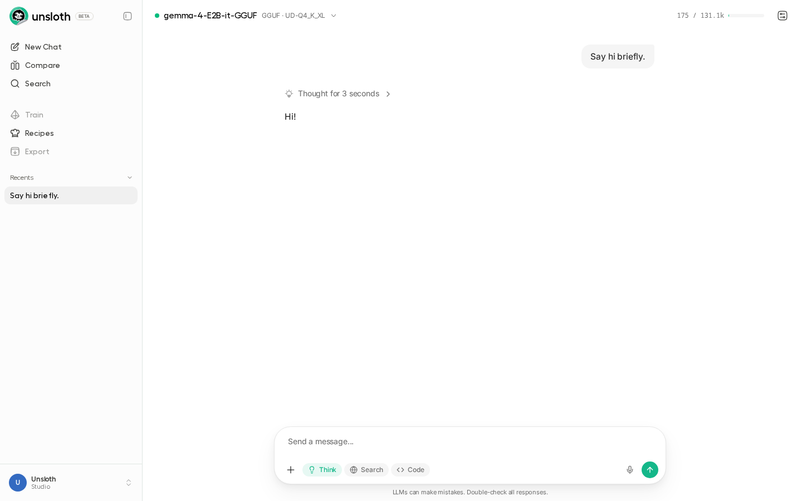

### [Unsloth Studio](https://github.com/unslothai/unsloth)

> Handle: `unsloth-studio`<br/>
> URL: [http://localhost:34851](http://localhost:34851)



Unsloth Studio is a no-code web UI for fine-tuning LLMs with the Unsloth library. It provides 2x faster training with 70% less memory compared to standard fine-tuning, and is powered by `llama.cpp` and Hugging Face under the hood. Studio runs from the unified `unsloth/unsloth` image but exposes only the Studio surface (port 8000) — the existing [`unsloth`](./2.3.51-Satellite-Unsloth.md) Harbor service continues to provide Jupyter Lab and SSH access on the same image when you need those.

> **Note:** Studio is in beta upstream. The two services share the `unsloth/unsloth` image and a single `--gpus all` reservation, so on a single-GPU host you should run only one of `unsloth` or `unsloth-studio` at a time.

#### First start

The unified `unsloth/unsloth:latest` image is large — roughly **~13.6 GB compressed** download, **~44.5 GB unpacked** on disk. Pre-pull it once so your first `harbor up` doesn't block on the download:

```bash
# Pre-pull via Docker (recommended on first install)
docker pull unsloth/unsloth:latest

# Or via Harbor
harbor pull unsloth-studio
```

#### Starting

```bash
# Start the service (opens Studio in your browser)
harbor up unsloth-studio --open
```

Access Studio at `http://localhost:34851`.

##### First-run security

> **Note:** Upstream's first-run flow ships a temporary admin password (`window.__UNSLOTH_BOOTSTRAP__`) inline in the Studio HTML until you complete the "Setup your account" form. Complete this password setup at first launch **before** exposing port 34851 to any network beyond `localhost` — otherwise anyone with reach to the port can read the bootstrap credentials and claim the admin account.

#### Configuration

##### Environment Variables

Following options can be set via [`harbor config`](./3.-Harbor-CLI-Reference.md#harbor-config):

```bash
# Studio Configuration
HARBOR_UNSLOTH_STUDIO_HOST_PORT=34851                          # Studio web UI port
HARBOR_UNSLOTH_STUDIO_WORKSPACE="./services/unsloth-studio/workspace"  # Local workspace dir
HARBOR_UNSLOTH_STUDIO_OPEN_URL="http://localhost:34851"        # URL opened by `harbor open`

# Docker Image
HARBOR_UNSLOTH_STUDIO_IMAGE="unsloth/unsloth"                  # Docker image
HARBOR_UNSLOTH_STUDIO_VERSION="latest"                         # Image tag
```

##### Volumes

The service mounts:
- `HARBOR_UNSLOTH_STUDIO_WORKSPACE` → `/workspace/work` — your local working directory for projects, datasets, and exports.
- `HARBOR_HF_CACHE` → `/root/.cache/huggingface` — shared Hugging Face model cache. The same cache is used by the `unsloth`, `vllm`, and other model-serving services, so models pulled once are available to all of them.

##### GPU Requirements

Unsloth Studio requires NVIDIA GPU passthrough via the NVIDIA Container Toolkit. Harbor wires this in automatically through `compose.x.unsloth-studio.nvidia.yml`.

##### Hugging Face Token

To download gated models or push fine-tuned models to the Hub, set your token:

```bash
harbor config set hf.token "hf_your_token_here"
```

The token is forwarded into the container as `HF_TOKEN`.

#### Usage

1. `harbor up unsloth-studio --open`
2. Pick a base model and a dataset in the Studio UI.
3. Configure training (LoRA rank, learning rate, epochs, etc.).
4. Run training. Outputs land in the workspace directory and can be exported to GGUF, Ollama, vLLM, or Hugging Face formats.

#### Troubleshooting

```bash
# Tail logs
docker logs -f $(harbor ps unsloth-studio --quiet)
```

- **Image pull is slow.** The unified `unsloth/unsloth` image is ~13.6 GB compressed / ~44.5 GB unpacked. Pre-pull with `docker pull unsloth/unsloth:latest`.
- **No GPUs visible inside the container.** Check that the NVIDIA Container Toolkit is installed and the Harbor `nvidia` capability is detected (run `harbor config get capabilities.default`, or set it manually with `harbor config set capabilities.default 'nvidia'`).
- **GPU is busy / device already in use.** You probably have the [`unsloth`](./2.3.51-Satellite-Unsloth.md) service running too. They share `--gpus all`; stop one before starting the other.
- **Need Jupyter Lab or SSH instead?** Use the existing [`unsloth`](./2.3.51-Satellite-Unsloth.md) service — same image, different ports.

#### Related Services

- [Unsloth](./2.3.51-Satellite-Unsloth.md) — Jupyter Lab + SSH on the same image. Do **not** run `unsloth` and `unsloth-studio` simultaneously on a single-GPU host; both will reserve `--gpus all` and collide.
- [vLLM](./2.2.3-Backend&colon-vLLM.md) — for serving fine-tuned LLMs.
- [Ollama](./2.2.1-Backend&colon-Ollama.md) — export fine-tuned models in GGUF for local inference.

#### Links

- [Unsloth Studio docs](https://unsloth.ai/docs/new/studio)
- [Studio install guide](https://unsloth.ai/docs/new/studio/install)
- [Unsloth GitHub](https://github.com/unslothai/unsloth)
- [DockerHub: unsloth/unsloth](https://hub.docker.com/r/unsloth/unsloth)
