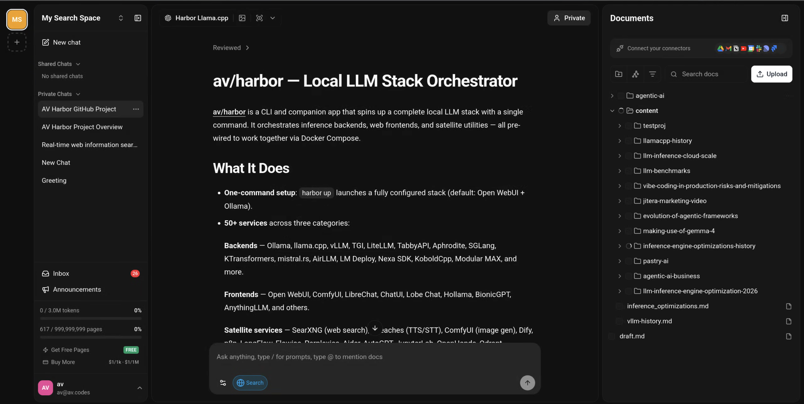

### [SurfSense](https://github.com/MODSetter/SurfSense)

> Handle: `surfsense`<br/>
> URL: [http://localhost:34851](http://localhost:34851)



SurfSense is an open-source, privacy-focused NotebookLM-style research workspace. It lets you collect files and web content, build searchable knowledge spaces, ask cited questions, generate reports, and create podcast-style audio over your saved sources.

#### Starting

```bash
# Pull the images
harbor pull surfsense

# Start SurfSense
harbor up surfsense --open
```

For the Harbor-native local LLM and web search path, start it together with an inference backend and SearXNG:

```bash
# Ollama-backed SurfSense with Harbor SearXNG web search
harbor up surfsense ollama searxng --open

# Or use llama.cpp as the LLM backend
harbor up surfsense llamacpp searxng --open
```

On first launch, create a local SurfSense account in the web UI. Harbor enables local registration by default.

#### Configuration

##### Environment Variables

Following options can be set via [`harbor config`](./3.-Harbor-CLI-Reference.md#harbor-config):

```bash
# Ports
HARBOR_SURFSENSE_HOST_PORT                 34851  # Public single-origin proxy (UI + API + Zero)
HARBOR_SURFSENSE_BACKEND_HOST_PORT         34852  # Optional direct FastAPI backend access
HARBOR_SURFSENSE_ZERO_HOST_PORT            34853  # Optional direct Zero access

# Images
HARBOR_SURFSENSE_PROXY_IMAGE               caddy
HARBOR_SURFSENSE_PROXY_VERSION             2-alpine
HARBOR_SURFSENSE_WEB_IMAGE                 ghcr.io/modsetter/surfsense-web
HARBOR_SURFSENSE_BACKEND_IMAGE             ghcr.io/modsetter/surfsense-backend
HARBOR_SURFSENSE_VERSION                   latest
HARBOR_SURFSENSE_ZERO_IMAGE                rocicorp/zero
HARBOR_SURFSENSE_ZERO_VERSION              0.26.2
HARBOR_SURFSENSE_DB_IMAGE                  pgvector/pgvector
HARBOR_SURFSENSE_DB_VERSION                pg17
HARBOR_SURFSENSE_REDIS_IMAGE               redis
HARBOR_SURFSENSE_REDIS_VERSION             8-alpine

# Persistent data
HARBOR_SURFSENSE_WORKSPACE                 ./services/surfsense

# Database
HARBOR_SURFSENSE_DB_USER                   surfsense
HARBOR_SURFSENSE_DB_PASSWORD               surfsense
HARBOR_SURFSENSE_DB_NAME                   surfsense

# Auth and public URLs
HARBOR_SURFSENSE_SECRET_KEY                harbor-surfsense-secret-change-me
HARBOR_SURFSENSE_AUTH_TYPE                 LOCAL
HARBOR_SURFSENSE_REGISTRATION_ENABLED      TRUE
HARBOR_SURFSENSE_NOLOGIN_MODE_ENABLED      FALSE
HARBOR_SURFSENSE_PUBLIC_FRONTEND_URL       http://localhost:34851
HARBOR_SURFSENSE_PUBLIC_BACKEND_URL        http://localhost:34851
HARBOR_SURFSENSE_PUBLIC_ZERO_URL           http://localhost:34851/zero

# Local processing defaults
HARBOR_SURFSENSE_ETL_SERVICE               DOCLING
HARBOR_SURFSENSE_EMBEDDING_MODEL           sentence-transformers/all-MiniLM-L6-v2
HARBOR_SURFSENSE_TTS_SERVICE               local/kokoro
HARBOR_SURFSENSE_STT_SERVICE               local/base
HARBOR_SURFSENSE_RERANKERS_ENABLED         FALSE
HARBOR_SURFSENSE_RERANKERS_MODEL_NAME      cross-encoder/ms-marco-MiniLM-L-6-v2
HARBOR_SURFSENSE_RERANKERS_MODEL_TYPE      cross-encoder

# Worker/indexing tuning
HARBOR_SURFSENSE_CELERY_MAX_WORKERS        1
HARBOR_SURFSENSE_CELERY_MIN_WORKERS        1
HARBOR_SURFSENSE_CELERY_MAX_TASKS_PER_CHILD  50
HARBOR_SURFSENSE_TOKENIZERS_PARALLELISM    false
HARBOR_SURFSENSE_OMP_NUM_THREADS           1
HARBOR_SURFSENSE_MKL_NUM_THREADS           1
HARBOR_SURFSENSE_OPENBLAS_NUM_THREADS      1
HARBOR_SURFSENSE_NUMEXPR_NUM_THREADS       1

# Harbor LLM/web-search integration
HARBOR_SURFSENSE_MODEL                     # empty = reuse Harbor's Ollama default chat model, fallback qwen3.5:4b
HARBOR_SURFSENSE_LLM_TEMPERATURE           0.2
HARBOR_SURFSENSE_LLM_MAX_TOKENS            4000
HARBOR_SURFSENSE_SEARXNG_URL               # empty unless overridden manually or by searxng integration

# Zero-cache tuning
HARBOR_SURFSENSE_ZERO_ADMIN_PASSWORD       surfsense-zero-admin
HARBOR_SURFSENSE_ZERO_NUM_SYNC_WORKERS     4
HARBOR_SURFSENSE_ZERO_UPSTREAM_MAX_CONNS   20
HARBOR_SURFSENSE_ZERO_CVR_MAX_CONNS        30
```

SurfSense runs behind a Caddy single-origin proxy by default. The browser reaches the UI, API, and Zero real-time sync through `HARBOR_SURFSENSE_HOST_PORT`, which avoids broken login/API calls when opening Harbor from a phone or another LAN device. The TypeScript compose module automatically rewrites default `localhost` public URLs to the host's LAN IP when generating Compose.

##### Volumes

SurfSense persists data in:

- `services/surfsense/postgres/` - pgvector PostgreSQL data
- `services/surfsense/redis/` - Redis append-only data
- `services/surfsense/zero/` - Zero replica state
- `services/surfsense/shared_tmp/` - shared upload/temp directory between API and workers
- `services/surfsense/Caddyfile` - single-origin proxy routing for UI/API/Zero
- `${HARBOR_HF_CACHE}` - reused for local embedding, STT, and TTS model caches

#### Harbor integrations

##### LLM backends

SurfSense uses a TypeScript compose module to generate its `global_llm_config.yaml` at startup when Harbor LLM backends are present. This makes the Harbor models appear as global SurfSense LLM configurations instead of requiring manual setup in the UI.

There are two separate model choices:

- `HARBOR_SURFSENSE_MODEL` is the chat/agent model used for answers, tool use, summaries, and report generation. Leave it empty with Ollama to use the first non-embedding model from `HARBOR_OLLAMA_DEFAULT_MODELS`, falling back to `qwen3.5:4b` when no chat model is configured there. With llama.cpp router mode, set `HARBOR_SURFSENSE_MODEL` explicitly to the model ID SurfSense should send to `/v1/chat/completions`; Harbor does not infer it from `HARBOR_LLAMACPP_MODEL` because llama.cpp may expose many router models.
- `HARBOR_SURFSENSE_EMBEDDING_MODEL` is the local Hugging Face/SentenceTransformers embedding model used to chunk and vector-index uploaded documents in pgvector. It is not an Ollama embedding model. Harbor keeps the upstream-compatible `sentence-transformers/all-MiniLM-L6-v2` default because changing embedding dimensions requires a clean pgvector reindex.

For more deterministic RAG answers, Harbor writes `HARBOR_SURFSENSE_LLM_TEMPERATURE` and `HARBOR_SURFSENSE_LLM_MAX_TOKENS` into the generated LiteLLM config. If you want SurfSense to use a specific model, set it explicitly:

```bash
harbor config set surfsense.model llama3.1:8b
harbor up surfsense ollama searxng
```

Supported automatic backend wiring:

- `ollama` → native SurfSense/LiteLLM Ollama provider at `http://ollama:11434`
- `llamacpp` → OpenAI-compatible provider at `http://llamacpp:8080/v1`

When both are running, both are written into SurfSense's global LLM configuration.

##### Retrieval quality

SurfSense can optionally rerank search results before they are sent to the LLM. Reranking downloads an additional Hugging Face model and uses more CPU/RAM, so Harbor leaves it disabled by default. To enable it:

```bash
harbor config set surfsense.rerankers.enabled TRUE
harbor config set surfsense.rerankers.model.name cross-encoder/ms-marco-MiniLM-L-6-v2
harbor config set surfsense.rerankers.model.type cross-encoder
harbor up surfsense
```

If you change `HARBOR_SURFSENSE_EMBEDDING_MODEL` after indexing documents, re-upload/reindex the documents so stored vectors and query vectors come from the same model.

##### SearXNG

Start with SearXNG to enable SurfSense web search:

```bash
harbor up surfsense searxng
```

The cross-file `services/compose.x.surfsense.searxng.yml` sets `SEARXNG_DEFAULT_HOST` to Harbor's internal SearXNG URL.

#### Troubleshooting

```bash
# Backend API logs
docker logs --tail=200 harbor.surfsense-backend

# Worker/indexing logs
docker logs --tail=200 harbor.surfsense-worker

# All current SurfSense containers
harbor ps | grep surfsense
```

Folder uploads run as Celery background tasks. Markdown and other plaintext files bypass Docling, but the first upload can still look idle while the worker downloads/warms the embedding model and indexes batches. Check progress with:

```bash
docker logs --tail=200 harbor.surfsense-worker
harbor config get surfsense.celery.max.workers
```

Harbor pins SurfSense worker autoscale to `HARBOR_SURFSENSE_CELERY_MAX_WORKERS=1` and `HARBOR_SURFSENSE_CELERY_MIN_WORKERS=1` by default, and caps tokenizer/BLAS thread pools to one thread. The upstream image defaults to autoscale `10,2`; a folder upload from the web UI is split into many 10-file Celery jobs, so the upstream default can launch many Python processes that all load the embedding model and each try to use multi-threaded Torch/BLAS. That looks like an embedding stall even though the queue is still alive. Increase worker and thread counts only on hosts with enough CPU/RAM.

If the UI loads but cannot sign in or chat, confirm the browser-facing URLs match your ports:

```bash
harbor config get surfsense.public.frontend.url
harbor config get surfsense.public.backend.url
harbor config get surfsense.public.zero.url
```

If Zero-cache fails to start, ensure `services/surfsense/postgresql.conf` is mounted and contains `wal_level = logical`. To reset all SurfSense state:

```bash
harbor down surfsense
rm -rf services/surfsense/postgres services/surfsense/redis services/surfsense/zero services/surfsense/shared_tmp
harbor up surfsense
```

#### Links

- [Official Documentation](https://docs.surfsense.com/)
- [GitHub Repository](https://github.com/MODSetter/SurfSense)
- [Docker Installation](https://docs.surfsense.com/docs/docker-installation)
